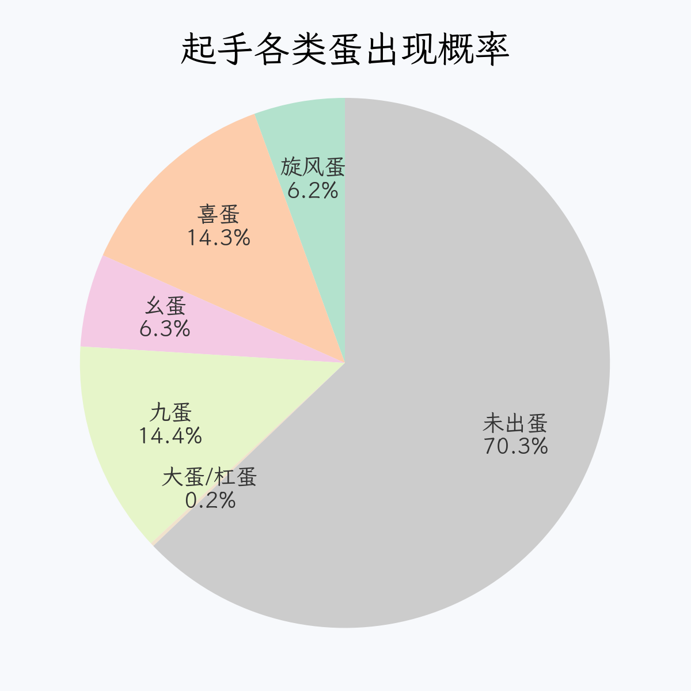
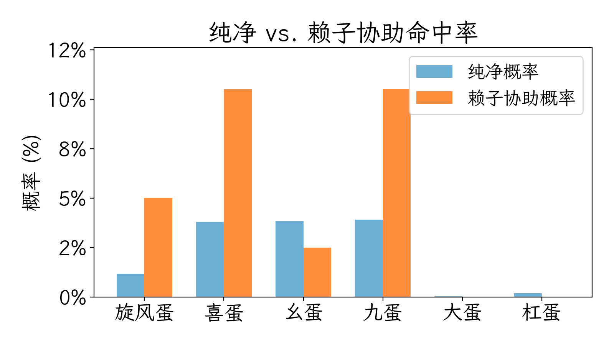
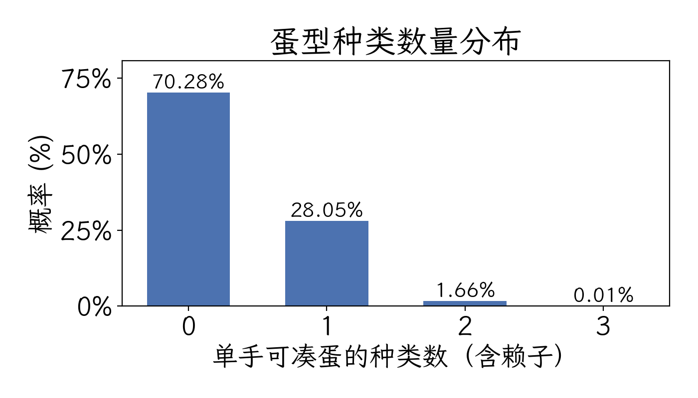
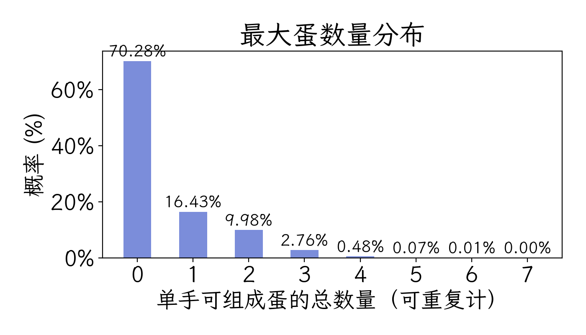
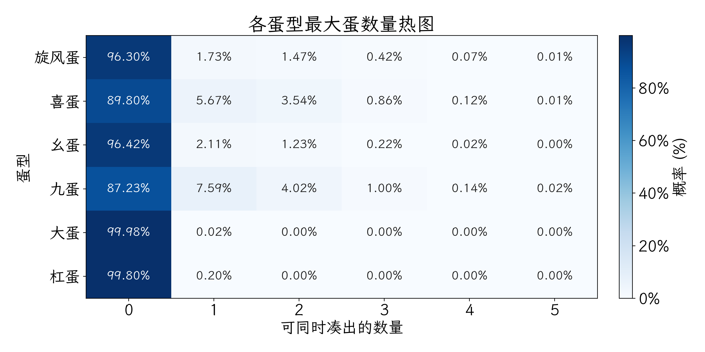
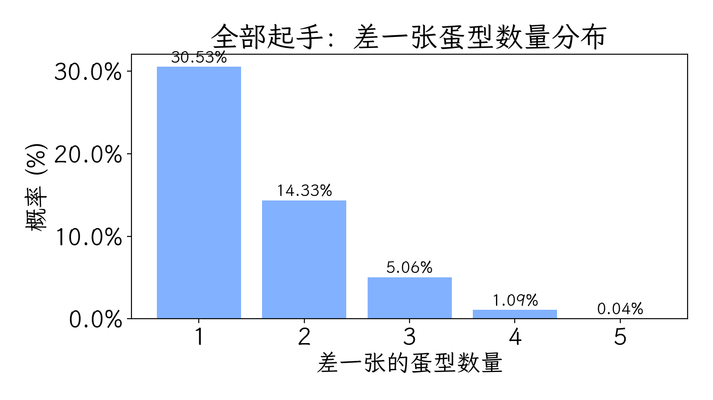
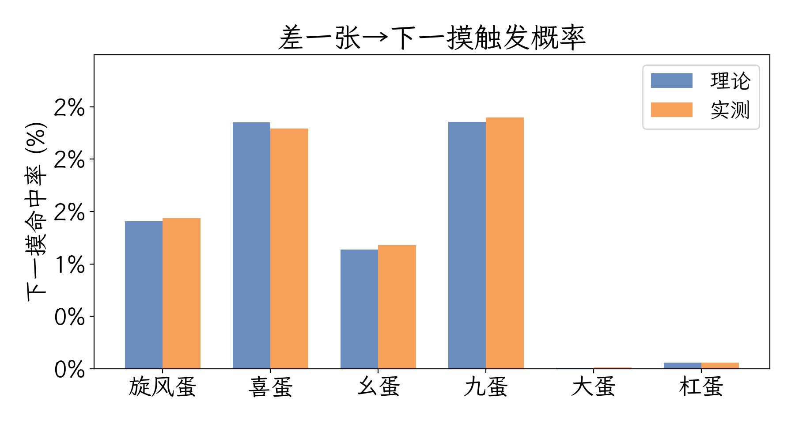
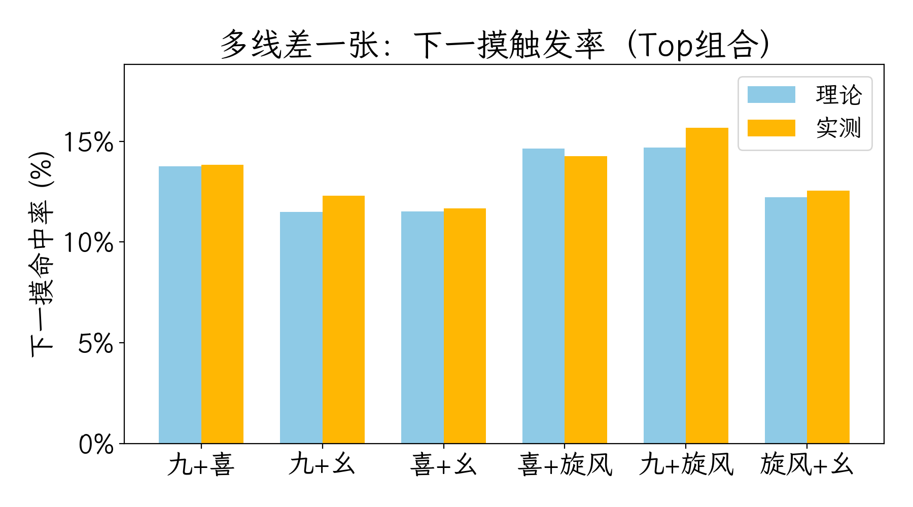

# 长春麻将玩“蛋”指南——蒙特卡罗模拟实测报告

> 今天让我们从科研的视角读博（bushi），放松一下。

## 一、关键结论
1. **开局直接有蛋 ≈ 29.72%**，其中 **12.61%** 完全纯净、**17.11%** 需要幺鸡补位，相当于每三局就能亮一次蛋。
2. **单线差一张 → 下一摸**：把余牌视作 123 张等概率牌堆时命中率 **6.50%**，按真实第 14 张则为 **6.52%**，几乎持平，说明“差一张”本身就是低赔率博弈。
3. **双线及以上差一张**：有 **27.41%** 的 13 张起手同时等待 ≥2 种蛋，下一摸命中率立刻翻倍到 **13.4%~13.6%**，尤其是“九+喜”组合，理论命中 **13.75%**、实测 **13.83%**。
4. **赖子就是命**：旋风/喜/九三大主力中，赖子贡献分别占到 **81%、73%、73%**；在双线待牌里，90% 以上的成功都靠幺鸡补位，切勿盲丢。
5. **多蛋仍稀少但不再是传说**：虽然 28.05% 的手牌能凑出至少一种蛋，但真正能一次抱走 ≥2 只蛋的概率约 **13.3%**（双蛋 9.98%、三蛋 2.76%、四蛋仅 0.48%），再往上迅速掉到万分级别。
6. **暗杠 / 大蛋的起手奇迹仅 0.24%**，把它们视为奖励事件即可，不必围绕它们设计战术。

## 二、规则背景：什么是“蛋”？
1. **基础牌量**：长春麻将固定去掉花牌与季节牌，留下 136 张（万、饼、条各 36 张，东南西北 + 中发白各 4 张）；庄家 14 张起手，闲家 13 张。
2. **蛋型速览**：
   - **旋风蛋**：东南西北齐全（俗称“风圈杠”），本模拟要求四风齐全；
   - **喜蛋**：中、发、白三元牌齐备；
   - **幺蛋 / 九蛋**：分别由万、饼、条的 1 / 9 组成，本文拆成两种番型；
   - **大蛋**：幺鸡、幺饼、红中、发财、白板任意一类四张暗杠；
   - **杠蛋**：除上述特权牌外，任何牌起手即成暗杠；
   - （可选）**三风蛋**：任意三风即可，但平台规则多要求“四风齐”，本文因此不单独计分。
3. **赖子设定**：幺鸡是唯一万能宝，可顶替旋风最多 3 张、喜/幺/九最多 2 张；当幺鸡本身直接参与幺蛋时记为纯净，不算赖子。
4. **判定口径**：只有发牌时就凑齐的暗杠才算蛋，杠蛋、大蛋均禁止赖子补齐；“三风”不单独计分，必须“四风齐”或用幺鸡补足缺失的风。

> **为什么要强调规则？** 主流线上平台（如波克、QQ 长春麻将）都采用“旋风必须四风齐 + 起手暗杠才算蛋”的口径，本文模拟完全对齐这套设定，结论才能直接拿去实战或教学。

## 三、初始下“蛋”概率
- 蒙特卡罗抽样次数：**100,000** 副起手；随机种子固定为 **20251204**，方便复现。
- 每轮从 136 张牌墙随机**抽 14 张**（假设是庄或者说最终的状态），记录是否命中任意蛋、是否使用赖子以及同一手牌能解锁几种蛋式。
- 所有统计都基于同一批牌谱，后续改规则只需重新判定，不必再次洗牌。

### 1. 各蛋出现概率
九蛋与喜蛋稳定占据“命中率双子星”位置（均约 **14.4%**），旋风蛋因“四风齐”限制只有 **6.21%**，其中 80% 以上要靠赖子；幺蛋 6.34%，纯净占比更高，因为幺鸡在此时不视为赖子。大蛋 + 杠蛋合计仅 **0.24%**，等同起手暗杠彩蛋。



### 2. 纯净 vs. 赖子贡献
旋风、喜、九三类蛋的赖子依赖度都超过 **70%**，只有幺蛋的纯净比例略高。赖子把总体命中率从 **12.61%** 拉高到 **29.72%**，净提升 **17.11 个百分点**。若手里有两张幺鸡，务必优先考虑“旋风 + 喜”或“旋风 + 九”这类双线布局。



（详细百分比见附录表 A-1，可与柱状图逐列对照。）

### 3. 收敛性验证


含赖子、纯净蛋以及各蛋型的累计概率在 **50,000** 副样本左右就进入平稳区，再扩大样本只是压缩噪音，当前 100,000 副规模已足够呈现真实水平。

## 四、蛋数统计：组合与叠加
为了兼顾“能解锁多少种蛋型”与“最多能抱走几只蛋”，我们把统计拆成下列三个维度。

### 1. 蛋型组合覆盖面
“组合数”只关注不同的蛋型：约 **28.05%** 的起手至少包含一种蛋，**1.656%** 可同时解锁 2 种，三种及以上仅 **0.013%**。换句话说，“自带双蛋”非常稀少，绝大多数双蛋都是靠赖子或后续补摸才成形。



### 2. 最大蛋数量
若同一蛋型可以重复计数（例如双喜蛋），**16.43%** 的起手恰好只有 1 只蛋，**9.98%** 能抱走 2 只，**2.76%** 能摸到 3 只；再往上就掉到 **0.48%（≥4 只）** 的量级。仍有 **70.28%** 的起手完全没蛋，这份分布更贴近“最多能亮几只蛋”的真实上限。



### 3. 各蛋型的最大蛋数量

拉到单个蛋型：旋风蛋第二只的出现率约 **1.47%**，第三只仍有 **0.42%**；喜蛋因为箭牌多，双喜概率 **3.54%**、三喜 **0.87%**；九蛋的双蛋也有 **4.02%**。虽然不是天文数字，但叠加主要来自风/三元/幺九这三条线，若对子齐全，保留它们往往比盲拆更值。




## 五、不是庄家的“差一张”胜率
在全部起手（含有蛋与无蛋）里，约 **51.04% 属于“13 张尚未成蛋，但至少有一条线只差一张就能亮蛋”的状态**；其余要么已经有蛋，要么至少差两张。下文所有“差一张”概率都只在这 51.04% 的手牌范围内统计。



> 横坐标意思是：有多少种蛋型都是差一张，再摸一张就可能亮蛋的。

继续沿用同一批 100,000 副牌谱，每副只取前 13 张视作“轮到我之前”的状态：
- **理论法：把 13 张起手视作当前手牌，余下 123 张未知牌等概率**，统计哪些牌能一摸成蛋，相当于问“差一张的计划价值”。
- **实测法：直接拿样本中的第 14 张当作下一张来摸**，只有当这张牌真实补齐蛋时才算命中，等价于问“按现在发牌顺序我能不能马上成蛋”。

两种算法都会先剔除已经成蛋的手牌，只统计“差一张”的情况。这样既能给出理想化的概率、也能反映真实发牌节奏。

### 1. 单线差一张：再摸一张能否开蛋？

> 理论法把余牌看成 123 张未知牌，下一摸命中率 **6.50%**；实测法直接看牌谱里的第 14 张，结果 **6.52%**。两者接近，说明只要严格按照“差一张”判断，不需要额外修正。

单线差一张的“胜率”只有 **6.5%** 左右，不到十五摸中一次，别指望下一张立刻开胡。相对比例就和正常差不多，旋风多了点，毕竟总牌数多四个。赖子贡献集中在旋风/喜/九三类蛋，占到各自命中率的 70% 以上。



（图上的百分比若需精确到小数，请参阅附录表 A-2。）


### 2. 多线差一张：双线及以上待牌
当起手同时差 ≥2 种蛋时，下一摸命中率直接翻倍：

- “至少有一条线只差一张就能亮蛋”的情况中，有约28%是“同时差两条线”的
- 这部分手牌下一摸的理论命中率 **13.41%**（所有双线及以上手牌的平均命中率），实测 **13.62%**，几乎是单线的两倍。

最常见的多线组合与命中率如下（赖子贡献列清楚后续调度方向）：

（Top 组合的具体数值列在附录表 A-3，可配合图中柱形使用。）



结论很直接：能凑出两条线就别只盯着其中一条，下一摸至少有一条命中的概率在 **11%~16%** 之间；如果还能把旋风也差一张，命中率立刻提升到 **20%+**，但赖子贡献高达 90%，要格外珍惜幺鸡。

### 3. 实战提示
- **识别真双线**：只有在 13 张还没成蛋、且至少两种蛋差一张时才算双线，单纯摸到一个蛋再等另一个不在此列。
- **赖子优先级**：双线待牌的成功绝大多数来自赖子，例如“喜+旋风”组合有 90% 成功靠幺鸡，除非桌面已经亮出多张幺鸡，否则不要轻易丢弃。
- **三线及以上**：像“九+喜+旋风”这类三线待牌虽只占 2% 左右，但命中率已经逼近 22%，若再叠加幺蛋则超过 25%，可以大胆守株待兔。
- **纯净补牌依旧重要**：即便赖子强势，诸如“九+幺”这样的组合仍有三分之一靠纯摸完成，保留原装字牌对子依旧提高成功率。

## 六、文件清单与复现方式
仓库地址：https://github.com/gxf1212/Probability_of_games

- `cc_majong/data/hands.parquet`：10 万副 14 张牌谱。
- `cc_majong/output/results.parquet`：逐副判定结果。
- `cc_majong/output/summary.json`：总体概率、组合分布与收敛曲线数据。
- `cc_majong/data/egg_multiplicity.json`：蛋数量（含重复）与各蛋型叠加统计。
- `cc_majong/data/next_draw.json`、`cc_majong/data/next_draw_empirical.json`：单线差一张的理论 / 实测概率。
- `cc_majong/data/next_draw_combos.json`、`cc_majong/data/next_draw_multiwait.json`：多线待牌的组合命中率及整体频率。
- `cc_majong/data/next_draw_wait_counts.json`：差一张人群的蛋型数量分布。
- `cc_majong/output/figures/*.png`：文中引用的全部中文图表。

最简复现（需 Python 3.11+ 与 `pip`）：
```bash
git clone https://github.com/gxf1212/Probability_of_games.git
cd Probability_of_games
python -m venv .venv && source .venv/bin/activate
pip install -r cc_majong/requirements.txt
PYTHONPATH=cc_majong/src python -m cc_majong.pipeline --seed 20251204
PYTHONPATH=cc_majong/src python -m cc_majong.refresh  # 重新计算差一张 & 绘图
```
`cc_majong.pipeline` 负责抽样、判定、生成 `summary.json / results.parquet`；`cc_majong.refresh` 则一次性写出所有 `next_draw*.json`、`egg_multiplicity.json`，并刷新 `output/figures` 与 `output/report.md`。

## 七、参考资料
- 波克游戏官网《长春麻将玩法说明》（纸牌房规整理）。
- 吉林地区玩家口述《长春麻将风圈杠口径》采访笔记。

## 附录：图表对应数据表

### 表 A-1 纯净 vs. 赖子贡献

| 蛋型 | 含赖子 | 纯净 | 赖子协助 |
| --- | --- | --- | --- |
| 旋风 | 6.209% | 1.189% | 5.020% |
| 喜 | 14.297% | 3.795% | 10.502% |
| 幺 | 6.336% | 3.833% | 2.503% |
| 九 | 14.432% | 3.911% | 10.521% |
| 大蛋 | 0.040% | 0.040% | 0.000% |
| 杠蛋 | 0.202% | 0.202% | 0.000% |

> 对应“纯净赖子柱状图”，用于读取精确数值或替换自家房规。

### 表 A-2 单线差一张 → 下一摸命中率

| 蛋型 | 理论-纯摸 | 理论-赖子 | 理论-总计 | 实测-纯摸 | 实测-赖子 | 实测-总计 |
| --- | --- | --- | --- | --- | --- | --- |
| 旋风 | 0.21% | 1.20% | **1.41%** | 0.20% | 1.23% | **1.44%** |
| 喜 | 0.50% | 1.85% | **2.35%** | 0.49% | 1.80% | **2.29%** |
| 幺 | 0.66% | 0.48% | **1.14%** | 0.68% | 0.50% | **1.18%** |
| 九 | 0.50% | 1.86% | **2.36%** | 0.50% | 1.90% | **2.40%** |
| 大蛋 | 0.01% | 0.00% | **0.01%** | 0.01% | 0.00% | **0.01%** |
| 杠蛋 | 0.06% | 0.00% | **0.06%** | 0.06% | 0.00% | **0.06%** |

> 对应“差一张→下一摸概率”，分列显示理论 / 实测、纯摸 / 赖子贡献。

### 表 A-3 多线差一张 Top 组合

| 组合 | 触发频率 | 理论-纯摸 | 理论-赖子 | 理论-总计 | 实测-纯摸 | 实测-赖子 | 实测-总计 |
| --- | --- | --- | --- | --- | --- | --- | --- |
| 九 + 喜 | 9.64% | 2.11% | 11.64% | **13.75%** | 2.16% | 11.67% | **13.83%** |
| 九 + 幺 | 7.80% | 3.65% | 7.84% | **11.50%** | 3.68% | 8.61% | **12.29%** |
| 喜 + 幺 | 7.79% | 3.64% | 7.88% | **11.52%** | 3.67% | 8.01% | **11.68%** |
| 喜 + 旋风 | 5.49% | 1.41% | 13.24% | **14.65%** | 1.28% | 12.98% | **14.26%** |
| 九 + 旋风 | 5.42% | 1.37% | 13.31% | **14.68%** | 1.66% | 14.02% | **15.68%** |
| 九 + 喜 + 幺 | 3.20% | 3.51% | 15.10% | **18.61%** | 3.13% | 15.67% | **18.79%** |
| 九 + 喜 + 旋风 | 2.18% | 0.83% | 21.13% | **21.96%** | 0.92% | 21.39% | **22.31%** |
| 九 + 喜 + 旋风 + 幺 | 0.86% | 3.13% | 22.82% | **25.96%** | 3.50% | 22.14% | **25.64%** |

> 对应“多线差一张命中率（Top 6）”，强调各组合的触发频率与命中率。
